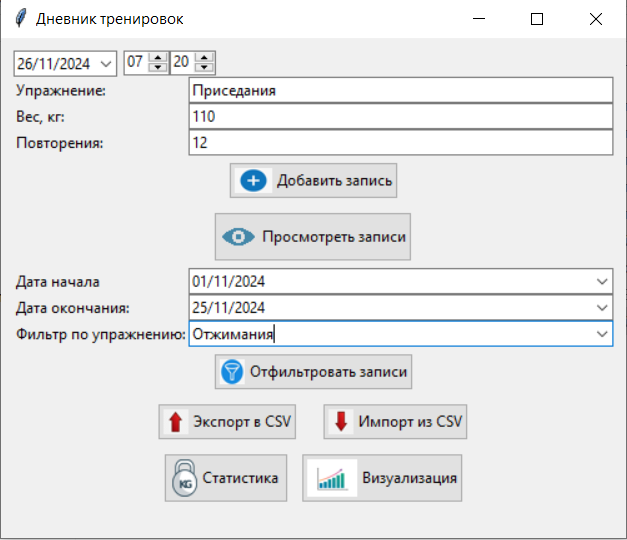

Проект "Журнал тренировок" 
==========================
## В проекте используется библиотека tkinter для графического интерфейса

### Импорты и настройки:
* import tkinter as tk: импорт основной библиотеки для создания графического пользовательского интерфейса 

* from tkinter import ttk, Toplevel, messagebox:
1. модуль ttk предоставляет расширенные виджеты для Tkinter, такие как стилизованные кнопки, метки и комбобоксы.
2. класс Toplevel используется для создания новых окон, независимых от основного окна приложения.
3. модуль messagebox позволяет отображать всплывающие окна с сообщениями, такими как предупреждения или ошибки.
 
* import json: модуль json позволяет преобразовывать в строку (и преобразовывать из строки) данные в формате JSON 

* from datetime import datetime: класс datetime из модуля datetime предоставляет методы для работы с датами и временем. 
Это позволяет выполнять операции, такие как получение текущей даты и времени, форматирование и арифметику дат.

--------------------------------------
## Структура программы

### Переменная data_file хранит имя файла, в который будут сохраняться данные о тренировках в формате JSON

### Функции загрузки и сохранения данных:
- load_data: пытается открыть файл с именем, указанным в переменной data_file, и загрузить из него данные в формате JSON. Если файл не существует или происходит ошибка при разборе данных, возвращается пустой список;
- save_data: принимает данные о тренировках в виде списка словарей и сохраняет их в файл в формате JSON. Данные форматируются с отступом для лучшей читаемости

### Класс TrainingLogApp:
- Конструктор класса __init__: принимает объект root, который является главным окном приложения, и вызывает метод create_widgets для создания виджетов интерфейса.
- Метод create_widgets: создает виджеты для ввода данных о тренировке (название упражнения, вес, количество повторений), кнопки для добавления записи о тренировке и просмотра сохраненных записей.
- Метод add_entry: считывает данные из полей ввода, проверяет их наличие, создает словарь с информацией о тренировке, добавляет его в список с данными и сохраняет изменения в файл. После добавления записи поля ввода очищаются, и пользователю показывается сообщение об успехе.
- Метод view_records: загружает сохраненные данные и отображает их в новом окне с помощью виджета Treeview. Для каждой записи создается строка в таблице.

### Функция main:
- Создает экземпляр Tk, который является главным окном приложения.
- Создает экземпляр приложения TrainingLogApp, передавая ему главное окно.
- Запускает главный цикл обработки событий Tkinter, чтобы окно приложения отображалось и реагировало на действия пользователя.

------------------
### Скриншоты работы программы:

#### Запуск проекта:
