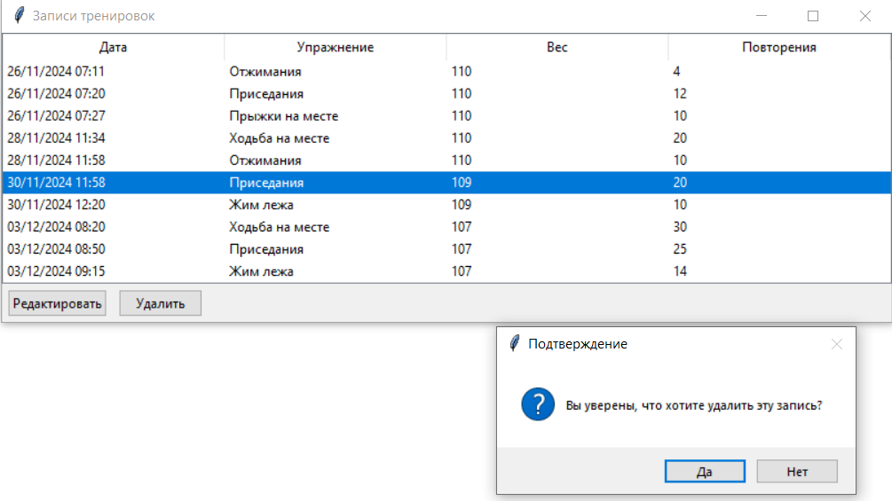

Проект "Дневник тренировок".  
==========================
## Реализованы ввод информации о тренировках и запись этой информации в файл формата JSON. Также доступны чтение информации, фильтрация записей, импорт в файлы формата CSV, построение графиков.

### В проекте используется библиотеки: 
#### - tkinter для графического интерфейса,
#### - datetime для работы с датами, 
#### - matplotlib для построения графиков.

--------------------------------------
## Структура программы

### В директории _"icons"_ содержатся файлы с иконками, соответствующие основным действиям пользователя (добавление, просмотр, фильтрация записей и др.)  

### Переменная _data_file_ хранит имя файла по умолчанию, в который будут сохраняться данные о тренировках в формате JSON

### Основные функции программы:
- resize_image: для изменения размера изображения иконок. Новые размеры для каждой иконки указываются в соответствующем методе класса TrainingLogApp 
- load_data: загрузка из JSON файла данных о тренировках. Применены обработки исключений для обработки возможных ошибок.
- save_data: принимает данные о тренировках в виде списка словарей и сохраняет их в файл в формате JSON. Данные форматируются с отступом для лучшей читаемости

### Класс DateTimePicker представляет пользовательский виджет для выбора даты и времени:
- DateEntry: виджет даты в формате "число/месяц/год". Пользователь может либо выбрать дату из календаря, либо ввести её вручную;
- метод validate_hour: проверяет корректность вводимого значения для часов. Разрешает только пустую строку (если поле очищено) или целые числа от 00 до 23;
- метод validate_minute: проверяет корректность вводимого значения для минут. Разрешает только пустую строку или целые числа от 00 до 59;
- метод get: возвращает строку, представляющую выбранные дату и время в формате дд/мм/гггг чч:мм.

### Класс TrainingLogApp:
- конструктор класса __init__: принимает объект root, который является главным окном приложения, и вызывает метод create_widgets для создания виджетов интерфейса;
- метод create_widgets: создает виджеты для ввода данных, кнопки для добавления записи о тренировке, просмотра и фильтрации сохраненных записей. Также реализованы кнопки экспорта записей в файлы CSV формата и импорта записей из них, кнопки формирования статистической информации и построения графиков;
- метод update_exercise_filter: обновляет список доступных упражнений для фильтрации;
- метод add_entry: считывает данные из полей ввода, проверяет их наличие, создает словарь с информацией о тренировке, добавляет его в список с данными и сохраняет изменения в файл; 
- метод view_records: загружает сохраненные данные и отображает их в новом окне с помощью виджета Treeview. Для каждой записи создается строка в таблице;
- метод filter_records: метод фильтрации записей по диапазону дат и упражнению;
- метод export_to_csv: применяется для экспорта данных в формат CSV. Пользователь задает имя файла в диалоговом окне, а файл сохраняется в папке files внутри проекта;
- метод import_from_csv: используется для импорта данных из CSV файла. Пользователь выбирает файл, и данные из него добавляются в журнал;
- метод edit_record: необходим для редактирования выбранной записи;
- метод delete_record используется для удаления выбранной записи;
- метод show_statistics: отображение статистики по выполненным упражнениям;
- метод show_charts: для визуализации прогресса по упражнениям. Применяется для построения графиков изменения веса и количества повторов упражнений. Графики также сохраняются в формате "png" в директории _"images"_.

### Функция main:
- Создает экземпляр Tk, который является главным окном приложения.
- Создает экземпляр приложения TrainingLogApp, передавая ему главное окно.
- Запускает главный цикл обработки событий Tkinter, чтобы окно приложения отображалось и реагировало на действия пользователя.

------------------
## Скриншоты работы программы:

### Запуск проекта:

### Сохранение журнала тренировок:

### Окно сохранения файла:

### Список упражнений (открывается по кнопке "Просмотреть записи"):

### Виджет редактирования выбранной записи:

### Виджет удаления выбранной записи:

### Сообщение об успешном удалении записи:

### Пример некорректной попытки фильтрации записей:

### Пример корректной попытки фильтрации записей:

### Пример экспорта данных в CSV файл:

### Сообщение об успешном экспорте данных в CSV файл:

### Виджет статистики тренировок:

### Сообщение о сохранении графиков в файлы формата PNG:

### График изменения количества повторений:

### График изменения веса:

### Файлы с графиками сохраняются в папку "images":

